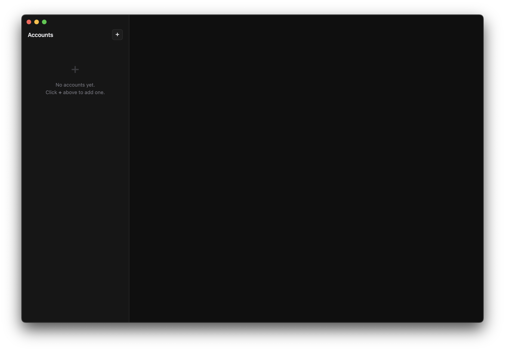
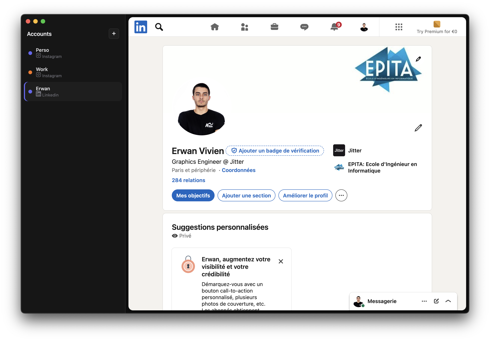

<p align="center">
  
</p>

<h1 align="center">Social Account Manager</h1>

<p align="center">
  Switch between multiple social media accounts instantly — each in its own isolated session.
</p>

---

## What is this?

Social Account Manager is a lightweight desktop app that lets you stay logged into **multiple accounts on the same platform** simultaneously. Each account runs in a fully isolated browser session (separate cookies, localStorage, and cache), so there's no need to constantly log in and out.

**Supported platforms:** Instagram, Twitter/X, Facebook, TikTok, LinkedIn, YouTube, Reddit, Threads.

## Screenshots

|               Empty state               |                   With accounts                   |
| :-------------------------------------: | :-----------------------------------------------: |
|  |  |

## Getting started

```bash
npm install
npm start
```

### Usage

1. Click the **+** button in the sidebar
2. Give the account a name, pick a platform, and choose a color tag
3. The platform loads in its own isolated session — log in once and you're set
4. Click any account in the sidebar to switch instantly
5. Hover an account to reveal **reload** and **remove** buttons

## License

Proprietary. See [LICENSE](LICENSE) for details.
